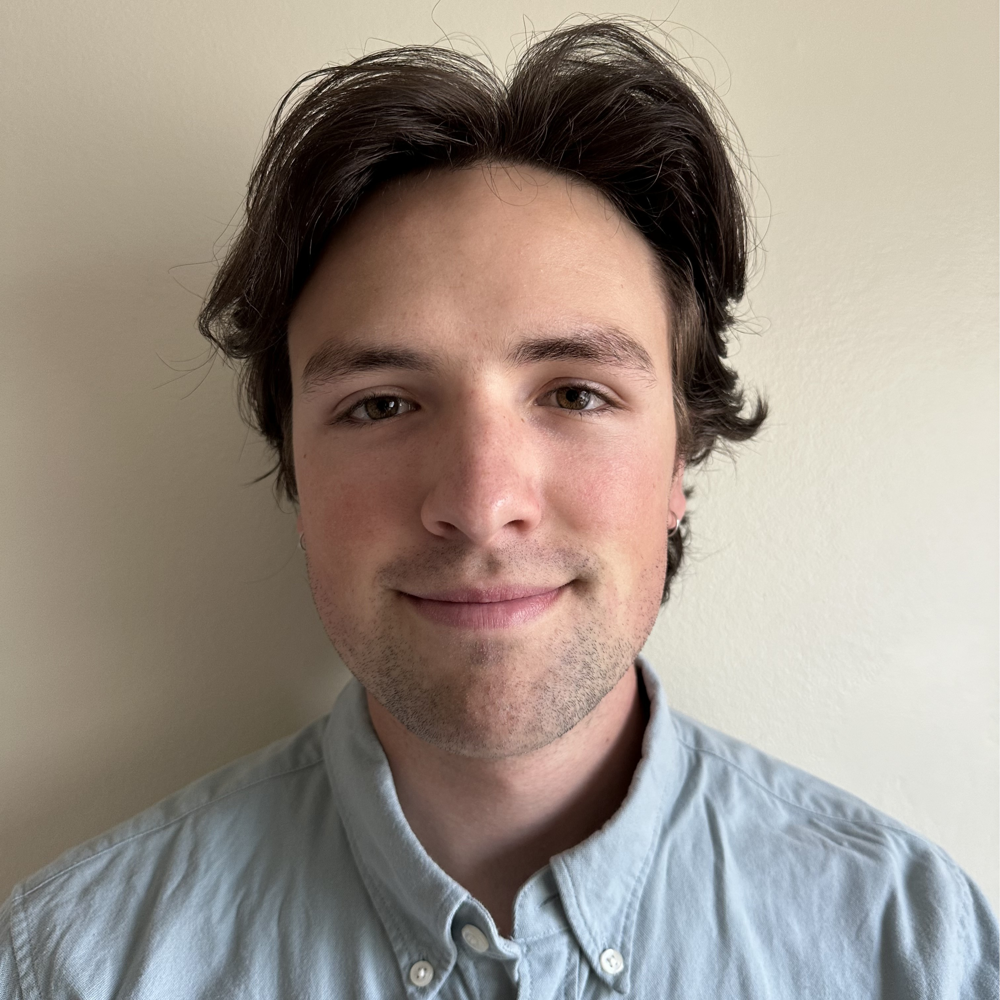

## About Me

Second-year Ph.D. student at the University of Utah performing research in computer security and fuzzing.

Outside of academia, I enjoy spending my time in the nearby Wasatch Mountains, reading, and eating good food!

## Contact
**Email**: [gabesherman6@gmail.com](mailto:gabesherman6@gmail.com)

**X**: [@gabe_sherman6](https://x.com/gabe_sherman6)

**Bluesky**: [@gabriel-sherman](https://bsky.app/profile/gabriel-sherman.bsky.social)

**Linkedin**: [@gabe-sherman](https://www.linkedin.com/in/gabe-sherman-891200/)

## Research Interest

My research focuses on fuzz testing, with a strong passion for proactively securing widely used software. I am particularly interested in extending fuzz testing to previously unexplored areas. My current work centers on automating harness generation for open-source libraries. Some of the bugs I have found can be found here: https://futures.cs.utah.edu/bugs/?search=gabe+sherman

## Publications
1. [**No Harness, No Problem: Oracle-guided Harnessing for Auto-generating C API Fuzzing Harnesses**](https://users.cs.utah.edu/~snagy/papers/25ICSE-b.pdf)

    Gabriel Sherman and Stefan Nagy

    International Conference on Software Engineering(**ICSE '25**)

## Invited Talks & Articles

------|----------| ----
**No Harness, No Problem: Oracle-guided Harnessing for Auto-generating C API Fuzzing Harnesses** | International Conference on Software Engineering | 04/2025
**Introduction to Fuzzing** | University of Utah Cybersecurity Club | 03/2025
**Automated Bug Finding** | Kahlert School of Computing | 09/2024
**Automated Harness Generation** | Mountain West Undergraduate Research Showcase | 11/2023

